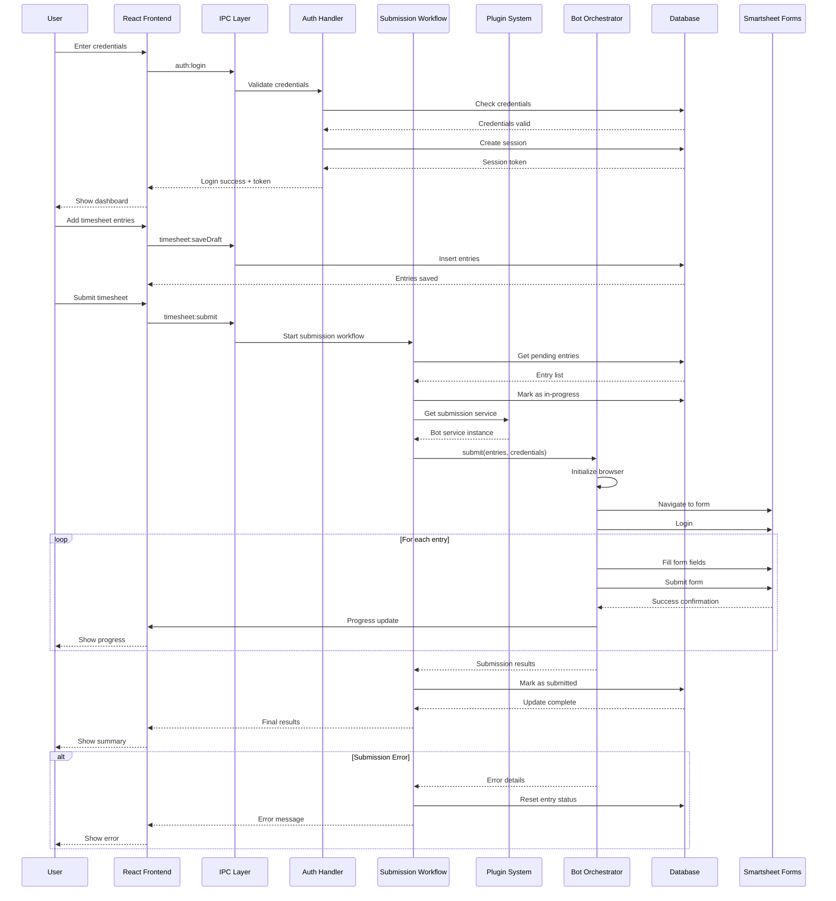
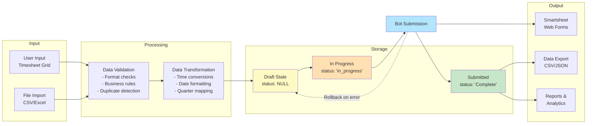
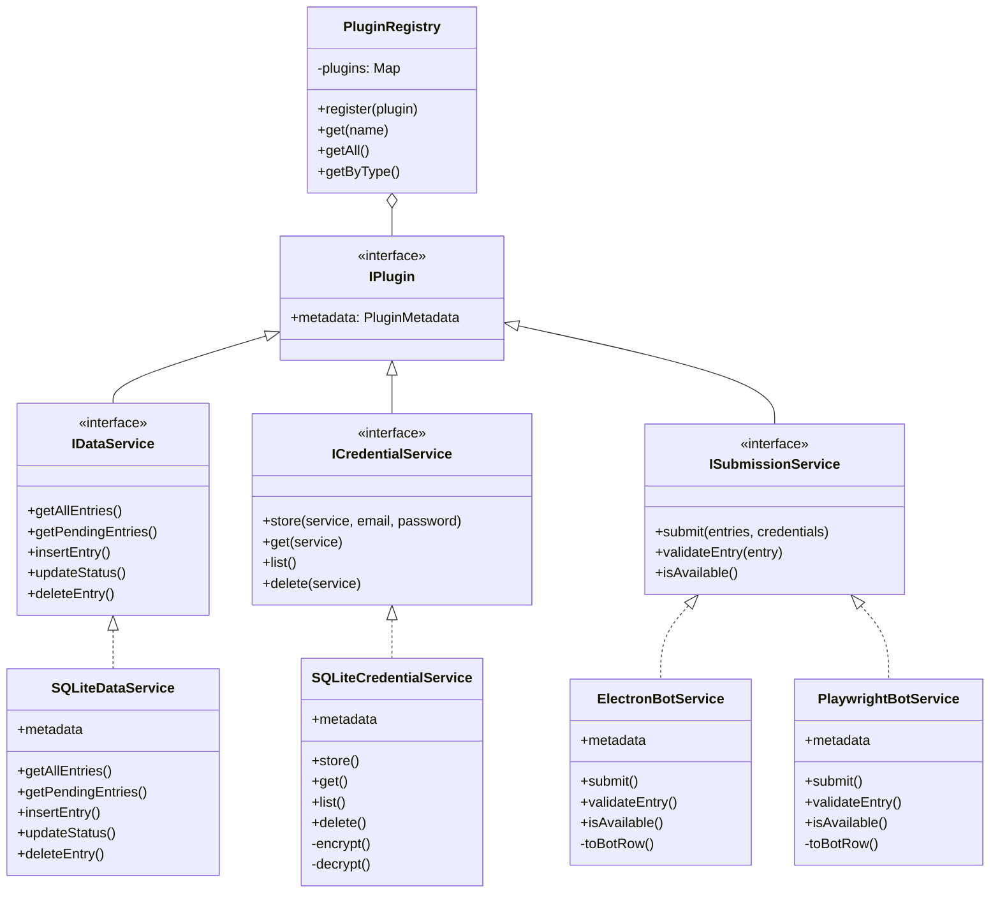
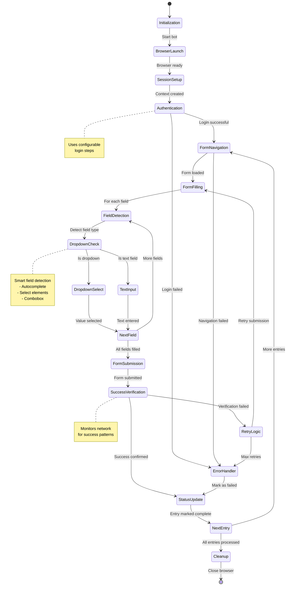

# Sheetpilot Architecture Diagram

## Complete System Architecture

```mermaid
graph TB
    subgraph "User Interface Layer"
        UI[React Frontend<br/>Vite + TypeScript]
        UI --> Components[Components<br/>- TimesheetGrid<br/>- DatabaseViewer<br/>- Settings<br/>- AdminPanel]
        UI --> Hooks[Custom Hooks<br/>- useTimesheet<br/>- useAuth<br/>- useSettings]
        UI --> Context[React Contexts<br/>- AuthContext<br/>- SettingsContext]
    end

    subgraph "Electron Main Process"
        Main[main.ts<br/>Application Entry Point]
        Main --> Bootstrap[Bootstrap Layer]
        Bootstrap --> EnvFlags[Environment Flags]
        Bootstrap --> Logging[Logging System]
        Bootstrap --> Database[Database Bootstrap]
        Bootstrap --> IPCSetup[IPC Setup]
        Bootstrap --> WindowMgmt[Window Management]
        
        Main --> IPCHandlers[IPC Handler Registry]
        IPCHandlers --> AuthIPC[Auth Handlers<br/>- Login<br/>- Session<br/>- Logout]
        IPCHandlers --> TimesheetIPC[Timesheet Handlers<br/>- Submit<br/>- Draft<br/>- Export<br/>- Reset]
        IPCHandlers --> CredsIPC[Credentials Handlers<br/>- Store<br/>- Get<br/>- Delete]
        IPCHandlers --> AdminIPC[Admin Handlers<br/>- Clear Data<br/>- Rebuild DB]
        IPCHandlers --> DatabaseIPC[Database Viewer<br/>Handlers]
        IPCHandlers --> LogsIPC[Logs Handlers]
        IPCHandlers --> SettingsIPC[Settings Handlers]
        IPCHandlers --> LoggerIPC[Logger Bridge<br/>Renderer → Main]
    end

    subgraph "Plugin Architecture"
        PluginRegistry[Plugin Registry]
        PluginRegistry --> DataPlugin[IDataService<br/>SQLite Implementation]
        PluginRegistry --> CredPlugin[ICredentialService<br/>SQLite Implementation]
        PluginRegistry --> SubmitPlugin[ISubmissionService<br/>Playwright/Electron Bot]
        
        DataPlugin --> DataOps[Data Operations<br/>- Insert<br/>- Query<br/>- Update<br/>- Delete]
        CredPlugin --> CredOps[Credential Ops<br/>- Encrypt<br/>- Decrypt<br/>- Store<br/>- Retrieve]
        SubmitPlugin --> BotOps[Submission Ops<br/>- Validate<br/>- Submit<br/>- Progress]
    end

    subgraph "Data Layer - SQLite Database"
        DB[(SQLite Database<br/>sheetpilot.sqlite)]
        
        DB --> TimesheetTable[Timesheet Table<br/>- id, date, time_in/out<br/>- project, tool<br/>- task_description<br/>- status, submitted_at]
        
        DB --> CredentialsTable[Credentials Table<br/>- service<br/>- email<br/>- encrypted_password<br/>- created_at]
        
        DB --> SessionsTable[Sessions Table<br/>- session_token<br/>- email, is_admin<br/>- expires_at]
        
        DB --> SchemaInfo[Schema Info<br/>- version<br/>- updated_at<br/>Singleton Pattern]
    end

    subgraph "Repository Layer"
        Repos[Repository Manager]
        Repos --> ConnMgr[Connection Manager<br/>- Singleton Pattern<br/>- WAL Mode<br/>- Health Checks]
        Repos --> TimesheetRepo[Timesheet Repository<br/>- CRUD Operations<br/>- Duplicate Check<br/>- Status Management]
        Repos --> CredsRepo[Credentials Repository<br/>- Encryption/Decryption<br/>- Master Key Management]
        Repos --> SessionRepo[Session Repository<br/>- Create/Validate<br/>- Expiration Management]
        Repos --> Migrations[Migration System<br/>- Version Tracking<br/>- Auto-Backup<br/>- Schema Evolution]
    end

    subgraph "Automation Layer - Bot System"
        BotOrch[BotOrchestrator<br/>Main Workflow Controller]
        
        BotOrch --> BrowserLauncher[BrowserLauncher<br/>Playwright/Electron<br/>Browser Management]
        
        BotOrch --> SessionMgr[WebformSessionManager<br/>- Context Management<br/>- Page Management<br/>- Navigation]
        
        BotOrch --> FormInteract[FormInteractor<br/>- Field Detection<br/>- Dropdown Handling<br/>- Smart Typing]
        
        BotOrch --> LoginMgr[LoginManager<br/>- Authentication Flow<br/>- Login Steps<br/>- Session Setup]
        
        BotOrch --> SubmitMonitor[SubmissionMonitor<br/>- Form Submission<br/>- Success Detection<br/>- Error Handling]
        
        BotOrch --> QuarterConfig[Quarter Configuration<br/>- Date-to-Form Mapping<br/>- Multi-Quarter Support]
    end

    subgraph "Business Logic Layer"
        Logic[Business Logic Services]
        
        Logic --> SubmitWorkflow[Submission Workflow<br/>- Entry Validation<br/>- Quarter Processing<br/>- Progress Tracking<br/>- Status Updates]
        
        Logic --> ValidationSvc[Validation Service<br/>- Input Schemas (Zod)<br/>- IPC Validation<br/>- Business Rules]
        
        Logic --> ImporterSvc[Timesheet Importer<br/>- Data Transformation<br/>- Bot Orchestration<br/>- Result Processing]
    end

    subgraph "Shared Layer"
        Shared[Shared Module]
        Shared --> Contracts[Contracts/Interfaces<br/>- IDataService<br/>- ICredentialService<br/>- ISubmissionService<br/>- IPlugin]
        Shared --> Constants[Constants<br/>- App Version<br/>- Settings<br/>- Business Config]
        Shared --> Utils[Utilities<br/>- Format Conversions<br/>- Date Utils<br/>- Time Utils]
        Shared --> Errors[Error Hierarchy<br/>- AppError Base<br/>- Category-based<br/>- User-friendly Messages]
        Shared --> Logger[Logger System<br/>- App Logger<br/>- Bot Logger<br/>- DB Logger<br/>- IPC Logger]
    end

    subgraph "External Systems"
        Smartsheet[Smartsheet Web Forms<br/>Multiple Quarters]
        AutoUpdater[Auto-Update System<br/>GitHub Releases]
        FileSystem[File System<br/>- Logs<br/>- Database<br/>- Cache]
    end

    %% Main flow connections
    UI -.IPC.-> IPCHandlers
    IPCHandlers --> PluginRegistry
    IPCHandlers --> Logic
    IPCHandlers --> Repos
    
    Logic --> PluginRegistry
    Logic --> Repos
    
    PluginRegistry --> Repos
    Repos --> DB
    
    BotOrch --> Smartsheet
    SubmitPlugin --> BotOrch
    ImporterSvc --> SubmitPlugin
    
    Main --> AutoUpdater
    Logging --> FileSystem
    DB -.Stored on.-> FileSystem
    
    %% Shared dependencies
    UI --> Shared
    Main --> Shared
    Logic --> Shared
    Repos --> Shared
    BotOrch --> Shared
    PluginRegistry --> Shared

    %% Styling
    classDef uiLayer fill:#e1f5ff,stroke:#01579b,stroke-width:2px
    classDef mainProcess fill:#fff3e0,stroke:#e65100,stroke-width:2px
    classDef dataLayer fill:#f3e5f5,stroke:#4a148c,stroke-width:2px
    classDef botLayer fill:#e8f5e9,stroke:#1b5e20,stroke-width:2px
    classDef pluginLayer fill:#fff9c4,stroke:#f57f17,stroke-width:2px
    classDef external fill:#ffebee,stroke:#b71c1c,stroke-width:2px
    classDef shared fill:#e0f2f1,stroke:#004d40,stroke-width:2px
    
    class UI,Components,Hooks,Context uiLayer
    class Main,Bootstrap,IPCHandlers,AuthIPC,TimesheetIPC,CredsIPC,AdminIPC,DatabaseIPC,LogsIPC,SettingsIPC,LoggerIPC mainProcess
    class DB,TimesheetTable,CredentialsTable,SessionsTable,SchemaInfo,Repos,ConnMgr,TimesheetRepo,CredsRepo,SessionRepo,Migrations dataLayer
    class BotOrch,BrowserLauncher,SessionMgr,FormInteract,LoginMgr,SubmitMonitor,QuarterConfig botLayer
    class PluginRegistry,DataPlugin,CredPlugin,SubmitPlugin,DataOps,CredOps,BotOps pluginLayer
    class Smartsheet,AutoUpdater,FileSystem external
    class Shared,Contracts,Constants,Utils,Errors,Logger shared
```

## Component Interaction Flow



## Data Flow Architecture



## Plugin Architecture Detail



## Bot Automation Workflow



## Key Technologies & Patterns

### Frontend Stack
- **React 18** - UI framework
- **TypeScript** - Type safety
- **Vite** - Build tool & dev server
- **Material-UI (M3)** - Component library
- **Handsontable** - Spreadsheet grid
- **React Context** - State management

### Backend Stack
- **Electron** - Desktop framework
- **Node.js** - Runtime
- **TypeScript** - Type safety
- **Better-SQLite3** - Database
- **Playwright** - Browser automation
- **IPC** - Inter-process communication

### Architecture Patterns
1. **Plugin Architecture** - Extensible services
2. **Repository Pattern** - Data access abstraction
3. **Singleton Pattern** - Database connection
4. **Observer Pattern** - IPC event system
5. **Factory Pattern** - Plugin instantiation
6. **Facade Pattern** - Simplified APIs
7. **Strategy Pattern** - Multiple submission methods

### Security Features
- **Encryption at rest** - Credentials encrypted
- **Session management** - Token-based auth
- **Input validation** - Zod schemas
- **Trusted sender checks** - IPC security
- **Master key** - Machine-specific or env-based
- **No plaintext passwords** - Always encrypted

### Performance Optimizations
- **WAL mode** - Concurrent DB access
- **Connection pooling** - Single connection
- **Lazy loading** - On-demand modules
- **Debounced saves** - Reduced DB writes
- **Progress streaming** - Real-time updates
- **Background processing** - Non-blocking operations
